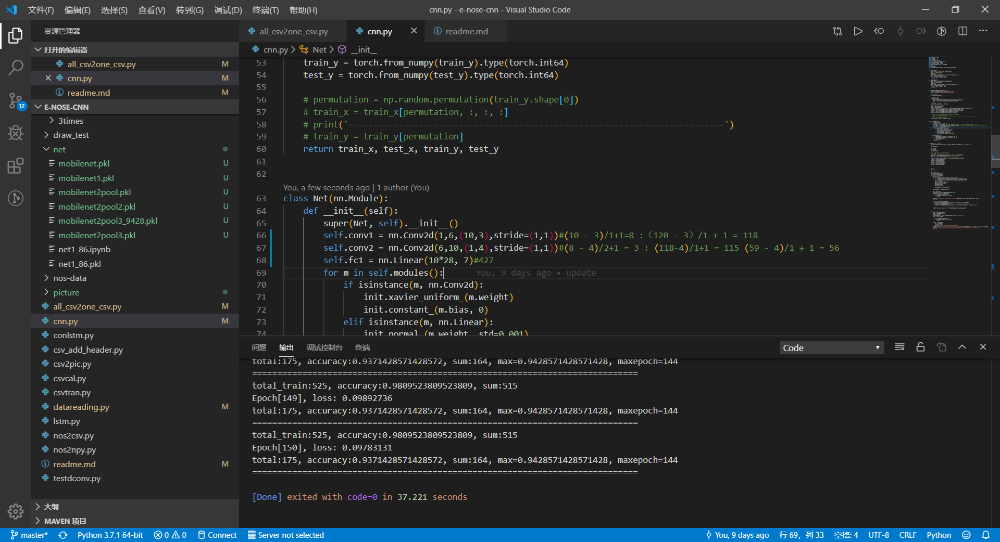
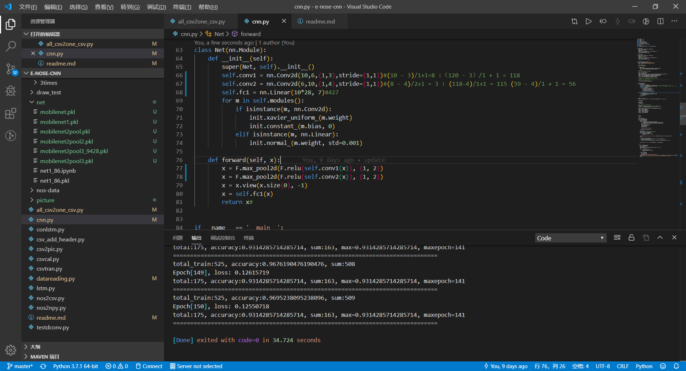
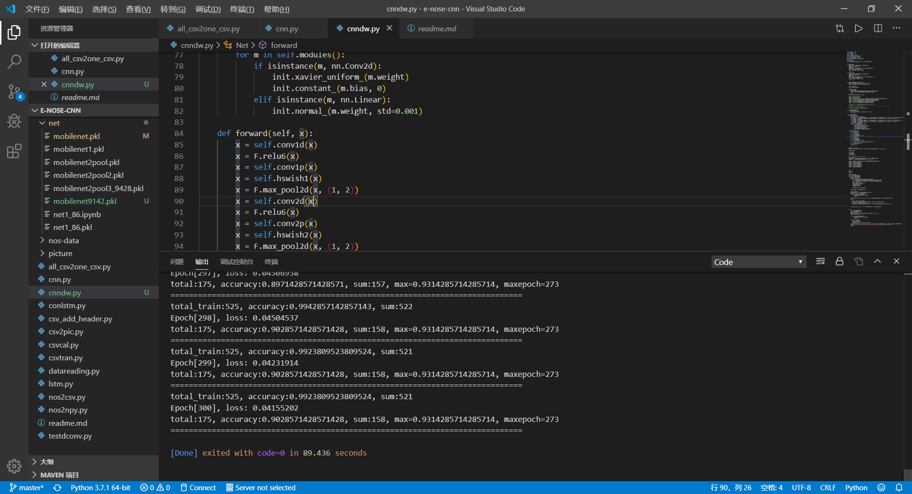

# e-nose cnn

## codedata

### 3times

第三次整理数据而命名

存放第三次整理数据的所有7类csv和最后的csv和标签

```python
#相对路径

#数据集
np.load('e-nose-cnn/codedata/3times/data.csv')
np.load('e-nose-cnn/codedata/3times/dataset.npy')

#标签
np.load('e-nose-cnn/codedata/3times/label.xlsx')
np.load('e-nose-cnn/codedata/3times/label.npy')
```

## draw_test

画图测试文件存放

## net

存放效果不错的网络，以testset的精度命名

## nos-data

原始数据，其中，每个文件夹的1是训练集，2是测试集

## 数据整理流程

1. 把每个nos转为csv,一定要加header；

2. 把每个csv转置并合成一个csv，一定要加header；

## 2019.10.29

之前的实验不理想，现在重新设计实验。

实验原则：

1. 把同一个标号的数据求均值，做一个样本；(弃用此方案，我是做分类，不是做回归，由于电子鼻采集时需要吸气，我们可以认为同一个物体连续采集多次，是浓度不同)

|名字|数据|
|:-:|:-:|
|槟榔|18+15+15=48|
|高良姜|20|
|砂仁|31|
|枳壳|100+|
|莪术|27|
|干姜|25+25+25+25=100|
|牡丹皮|8+27+27+27+27=116|

### 解决问题

分类类别不确定，每类样本数量不确定的分类问题。

### 首先进行数据处理

1. 以实验原则为底线，处理数据；

2. 在代码中加入新的想法。

### 参考论文

Cost-sensitive learning of deep feature representations from imbalanced data.

## 2019.11.1

现在确定一下工作方向

* 首先数据从原始数据中找出来，每类找一百个。如果数量少的，如高良姜等，则找一个文件夹中的1234个。其他超过的，就只要第一个。

### 数据处理

1. nos转csv

2. csv转图像，找出每个csv前面还没起来的，裁剪前面的。然后裁剪后面的，只要10*100的数据,我觉得可以先试一下没有裁剪的(不做)

### 训练

1. 先用cnn

2. 然后看别人fpga做cnn的论文和代码，再决定是否使用cnn+svm

3. 算法可以使用的方向是：预测精度达到90以上，预处理算法可以接受进来一个数据处理一个，不需要整体处理

### 结果

cnn效果好好啊啊啊啊啊

凉凉

## 2019.11.13

使用不同MobileNet的思想进行e-nose的cnn加速

### 保存网络

```python
torch.save(net1, '7-net.pkl')  # 保存整个神经网络的结构和模型参数
```

### 下载网络

```python
net2 = torch.load('7-net.pkl')
prediction = net2(x)
```

### 创新点

1. 在e-nose中使用深度可分离卷积；

2. 激活函数除4；

### 数据对比

如果需要下载网络，一定要记下来网络。

* 把所以数据以一个二维矩阵(即10* 120)的格式放进去之后，结果大概为：



精度大约为0.9428

此时卷积核参数个数为：(10 x 3 x 6) + (1 x 4 x 10) = 220

* 把数据折叠起来进行测试(即10* 1* 120)的格式放进去的时候，结果为：



精度为0.9314，网络输入输出为`10 -> 6 -> 10`，第一层为(1, 3)的卷积核，步长1，一个(1, 2)的池化；第二层为(1, 4)的卷积核，步长1，一个(1, 2)的池化。

卷积核参数个数为：(1 x 3 x 6)+(1 x 4 x 10)= 58

使用moblienet之后，卷积核权重参数个数为：(1 x 3 x 10) + 6 + (1 x 4 x 6) + 10 = 70数量远小于220

* 使用了深度可分离卷积 + h-swish激活pointwise convolution + relu6激活depthwise convolution



精度为0.9314，这差不多是mobilenetv3的架构

在我使用的网络里面，不需要BN层，因为BN层之后精度反而下降了。具体可以看[cnndwBN.py](./cnndwBN.py)

### 保存模型说明

#### mobilenet1.pkl

使用深度可分离卷积，使用交叉验证法，本次训练效果达到96%

```python
self.conv1d = nn.Conv2d(in_channels = 10, out_channels = 10, kernel_size = (1, 3), stride = 1, groups = 10)#(120 - 3)/1 + 1 = 118
self.conv1p = nn.Conv2d(in_channels = 10, out_channels = 6, kernel_size = 1, stride = 1, groups = 1)
self.hswish1 = hswish()
self.conv2d = nn.Conv2d(in_channels = 6, out_channels = 6, kernel_size = (1, 4), stride = 1, groups = 6)#(59 - 4)/1 + 1 = 56
self.conv2p = nn.Conv2d(in_channels = 6, out_channels = 10, kernel_size = 1, stride = 1, groups = 1)
self.hswish2 = hswish()
self.fc1 = nn.Linear(10*28, 7)#427

lrr = 0.01
mom = 0.95
batch_size = 21

 if (sum / total_train > 0.85) :
    optimizer = optim.SGD(cnn.parameters(), lr=lrr/10, momentum=mom/4)
elif (sum / total_train > 0.95) :
    optimizer = optim.SGD(cnn.parameters(), lr=lrr/10/10, momentum=mom/4/4)
```

#### mobilenet2

模型同上，效果0.9371，不同点：把除6变成除4，除法变成移位寄存器。

```python
class hswish(nn.Module):
    def forward(self, x):
        out = x * F.relu6(x + 3) / 4
        return out
```

islide  ppt
