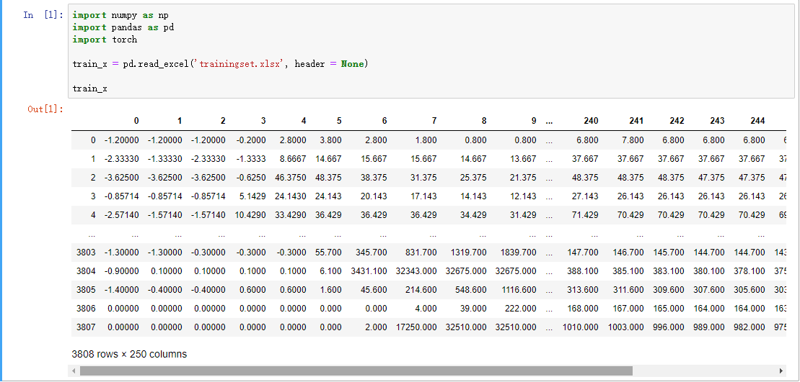
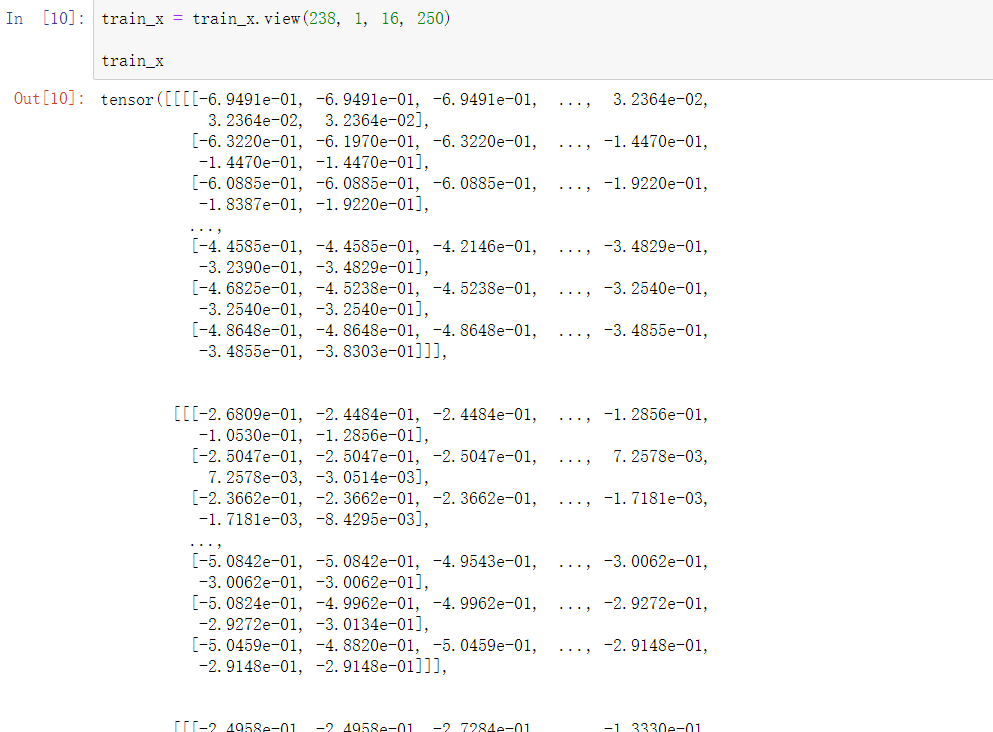
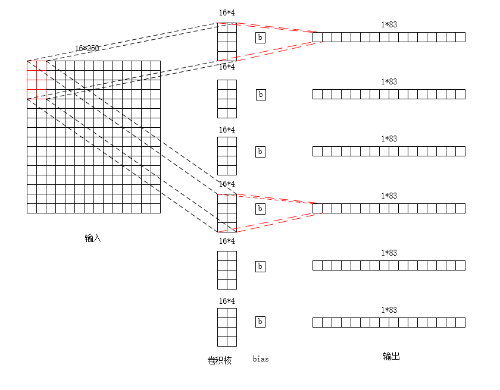
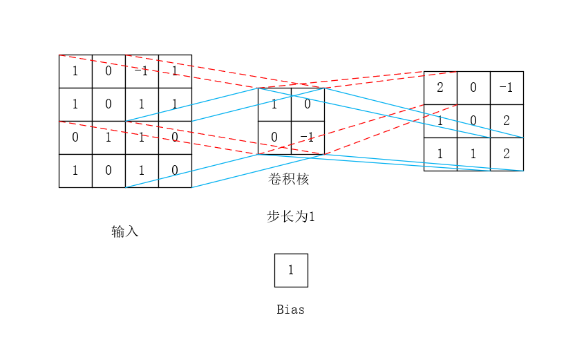

## 1. 首先调包

有pandas、torch、numpy

```ptyhon
import pandas as pd
import torch
import numpy as np
import torch.nn as nn
import torch.nn.functional as F
import torch.optim as optim
import torch.nn.init as init
from torch.autograd import Variable
```

## 2. 归一化处理

在这段程序中，先找出每一行（在这个数据集中，每一行为一个传感器采集的样本）的最大值`Zmax`、最小值`Zmin`和均值`Zmean`，然后将数据映射到[-1,1]->`Z = (Z - Zmean) / (Zmax - Zmin)`。

```python
def Normlize(Z):
  Zmax, Zmin = Z.max(axis=1), Z.min(axis=1)
  Zmean = Z.mean(axis=1)
  #按列排序
  Zmax, Zmin = Zmax.reshape(-1, 1), Zmin.reshape(-1, 1)
  Zmean = Zmean.reshape(-1, 1)
  Z = (Z - Zmean) / (Zmax - Zmin)
  return Z
```

## 3. 读取数据

原始的excel是这样的：



数据记过处理保存（这个操作我认为是调不同的包数据保存类型不一样才要做的），读取出来之后是一个二维数组：

```python
array([[-1.2000e+00, -1.2000e+00, -1.2000e+00, ...,  6.8000e+00,
         6.8000e+00,  6.8000e+00],
       [-2.3333e+00, -1.3333e+00, -2.3333e+00, ...,  3.6667e+01,
         3.6667e+01,  3.6667e+01],
       [-3.6250e+00, -3.6250e+00, -3.6250e+00, ...,  4.6375e+01,
         4.7375e+01,  4.6375e+01],
       ...,
       [-1.4000e+00, -4.0000e-01, -4.0000e-01, ...,  3.0060e+02,
         2.9860e+02,  2.9660e+02],
       [ 0.0000e+00,  0.0000e+00,  0.0000e+00, ...,  1.6100e+02,
         1.6000e+02,   1.5900e+02],
       [ 0.0000e+00,  0.0000e+00,  0.0000e+00, ...,  9.6200e+02,
         9.5600e+02,  9.4900e+02]])
```

然后把数据进行归一化，这里有六个数据集，一个是训练集，两个测试集，还有两个分别是各自的标签。

这里由于标签是别人给的，嗅感值，也要进行归一化，但是如果是自己的数据，打标签的时候可以有意地把标签放在某一段，如：[0,1]之间，就可以不用进行归一化。

```python
train_x_Normed = Normlize(train_x)
test_x_Normed = Normlize(test_x)
test_z_Normed = Normlize(test_z)
train_y = train_y / 10000
testy1 = testy1 / 10000
testy2 = testy2 / 10000
```

最后把每一个数据放进一个东西里面，这里我把这个输出出来，是个tensor。



## 4. 网络设计以及计算过程

在这里是一个3层网络：

```python
self.conv1 = nn.Conv2d(1,6,(16,4),stride=(1,3))
self.conv2 = nn.Conv2d(6,10,(1,3),stride=(1,2))
self.fc = nn.Linear(10*1*41,1)
```

1. 第一层一个卷积神经网络`self.conv1 = nn.Conv2d(1,6,(16,4),stride=(1,3))`，输入为1层，输出6层，卷积核大小为16*4，步长为（1,3）;

2. 第二层也是一个卷积神经网络`self.conv2 = nn.Conv2d(6,10,(1,3),stride=(1,2))`，输入为6层，输出10层，卷积核大小为1*3，步长为（1,2）;

3. 第三层是一个全连接层`self.fc = nn.Linear(10*1*41,1)`，这里的意思是把数据乘加起来；

训练代码如下：

```python
batch_size = 14
def train(train_x,train_y,step=20):
  for epoch in range(160):
    for i in range(0,(int)(len(train_x)/batch_size)):
      t_x = Variable(train_x[i*batch_size:i*batch_size+batch_size])
      t_y = Variable(train_y[i*batch_size:i*batch_size+batch_size])
      t_x = t_x.to(device)
      t_y = t_y.to(device)
      out = cnn(t_x)
      #forward
      #loss_func = nn.MSELoss() 均方损失函数  loss(x(i),y(i)) = (x(i) - y(i))^2
      loss = loss_func(out, t_y)
      #梯度初始化为零
      optimizer.zero_grad()
        
      #backward
      loss.backward()
      optimizer.step()
    if (epoch + 1) % step == 0:
      print('Epoch[{}/{}], loss: {:.12f},'.format(epoch + 1,160, loss.item()))
```

这段代码中，这个网络一共训练了160次，每20次打印一次loss，每次训练又分为`238/14=17`次，每次训练14个样本（我觉得应该是这样），这里每一个样本经过前向传播之后，计算一个loss，然后每一个batch训练完之后，计算一次loss的均值，之后再进行反向传播（计算梯度），最后根据学习率，更新权重；

### 前向传播

那么，前向传播的时候，结构为：

```python
def forward(self, x):
  x = F.relu(self.conv1(x))
  x = F.relu(self.conv2(x))
  x = x.view(x.size(0), -1)
  x = self.fc(x)
  return x
```
卷积出来之后，进入relu激活函数，然后拉成一行，最后和进入全连接层。

在此，我把每层的size打印出来：

```python
def forward(self, x):
  x = F.relu(self.conv1(x))
  print(0)
  print(x.size(0))
  print(x.size(1))
  print(x.size(2))
  print(x.size(3))
  x = F.relu(self.conv2(x))
  print(1)
  print(x.size(0))
  print(x.size(1))
  print(x.size(2))
  print(x.size(3))
  x = x.view(x.size(0), -1) 
  print(2)
  print(x.size(0))
  print(x.size(1))
  x = self.fc(x)
  print(3)
  print(x.size(0))
  print(x.size(1))
  return x
```

结果为

```python
0
14
6
1
83

1
14
10
1
41

2
14
410

3
14
1
```

1. 这里的`x.size(0) = 14`，是在训练的时候，这个代码设置的，每次训练14个样本；

2. 两个卷积层的`x.size(1)`代表输出的channel；

3. 两个卷积层的`x.size(2)`和`x.size(3)`代表卷积后的大小，第一层为（1,83），第二层为（1,41）；

4. 然后排成一行，最后全连接；

以下为第一层卷积网络计算图示：



$$
x_{ij}^{l} = f(u_{ij}^{l}) = f(\sum_{p = 1}^{n}\sum_{q = 1}^{m}x_{i+p-1,j+q-1}^{l-1}*k_{pq}^{l} + b^{l})  (i = 1,2,...,n)(j=1,2,...m)
$$

在这里，`n=16,m=4`，`l`为当前层数，`(i,j)`表示卷积完之后的位置，`k`为卷积核。

也就是说，这个输入的二维矩阵，和卷积核进行卷积，实际是就是对应位置进行相乘，然后再相加，在加上bias之后，经过激活函数`f(·)`输出，如下图例：



那么，对于这个第一层卷积网络，和卷积的基本运算就是这样。

但是，这里有六个卷积核，

在第二层网络中，卷积的个数又变多了，输入为6，输出为10，由于在第一层中，输出是6个`1*83`的二维数组，那么其实第二层的输出就是`6*1*83`的三维数组，那么每个第二层的卷积核进行卷积后输出。根据程老师的描述，我觉得公式应该是这样的：

$$
x_{ij}^{l} = f(u_{ij}^{l}) = f(\sum_{a=1}^{6}\sum_{p = 1}^{n}\sum_{q = 1}^{m}x_{i+p-1,j+q-1}^{l-1}*k_{pq}^{l} + b^{l}) 
$$

这里的`a`是上一层的输出，一共六个输出，然后每个输出和这一层的卷积核进行卷积之后相加之后输出。

那么整个网络就有`6*16*4 + 6 + 10*1*3 + 10 + 410 + 1 = 841`个参数，也可以说是权值，神经网络就是训练这些东西。

### 反向传播

首先，在所有应用问题中（不管是网络结构，训练手段如何变化）我们的目标是不会变的，那就是网络的权值和偏置最终都变成一个最好的值，这个值可以让我们由输入可以得到理想的输出，于是问题就变成了`y=f(x，w，b)`（x是输入，w是权值，b为偏置，所有这些量都可以有多个，比如多个`x1，x2，x3……`最后`f(·)`就好比我们的网络它一定可以用一个函数来表示，我们不需要知道`f(x)`具体是怎样的函数，从小我们就认为只要是函数就一定要是可表示的，像`f(x)=sin(x`)一样，但是请摈弃这样的错误观念，我们只需要知道一系列的`w`和`b`决定了一个函数`f（x`），这个函数让我们由输入可以计算出合理的`y`。

在这里让`（y-t）^2`的值尽可能的小。于是原先的问题化为了`C（w，b）=（f（x，w，b）-t）^2`取到一个尽可能小的值。


分3步

1. 计算loss

在`out=cnn(t_x)`之后，`loss = loss_func(out, t_y)`，在这里，`loss_func = nn.MSELoss()`，公式为：

$$
l(x, y) = L = \{l_{1}, \ldots ,l_{n}\},l_{n} = (x_{n} - y_{n})^{2}
$$

默认下，此函数输出为（`mean`）：
$$
\begin{equation}
l(x, y) = 
\begin{array}{rcl}
mean(L)  &  if  reduction is 'mean';} \\
sum(L)   &  if  reduction is 'sum';}
\end{array}
\end{equation}
$$

由于直接使用`MSELoss()`，那么在`loss = loss_func(out, t_y)`之后，如果`print(loss)`的话，则这个loss是`mean(L)`，也就是：

$$
loss = \frac{ (x_{1} - y_{1})^{2} + (x_{2} - y_{2})^{2} + \ldots + x_{n} - y_{n})^{2} }{ n } ,(n = batchsize = 14)
$$

2. 计算梯度

就是使用loss，计算每一个权值的。

如何计算这里有个例子：[反向传播详解](https://www.cnblogs.com/charlotte77/p/5629865.html)

3. 更新权重

$$
weight = weight + v
$$

一般来说：
$$
v = -grad * lr
$$


但是有momentum时: 

$$
v = -grad * lr + v_{old} * momentum
$$

## 5. 参数初始化

1. init.xavier_uniform_(m.weight)

根据[pytorch介绍](https://pytorch.org/docs/stable/nn.init.html?highlight=xavier#torch.nn.init.xavier_uniform_)，这个函数使用均匀分布填充权值，来自[这篇论文](http://proceedings.mlr.press/v9/glorot10a/glorot10a.pdf)权值范围是：

$$
W \sim U \left [ -\frac{ \sqrt{6} }{ \sqrt{n_{j}+n_{j+1}} }, \frac{ \sqrt{6} }{ \sqrt{n_{j}+n_{j+1}} } \right ]
$$

所以pytorch包中：

$$
U(-a,a),a=gain*\sqrt{\frac{ 6 }{ fan\_in + fan\_out }}
$$

参数gain默认情况下为1，然后根据我的理解和参考[别人的代码](https://github.com/tostq/DeepLearningC)，应该是随机生成一个`[-1,1]`之间的数，并乘上这个a，`fan_in`和`fan_out`分别是输入层数和输出层数。

2. init.normal_(m.weight, std=0.01)

和上面的函数来自同一篇论文，[代码介绍](https://pytorch.org/docs/stable/nn.init.html?highlight=torch%20nn%20init%20normal_#torch.nn.init.normal_)。

在论文中，有公式：

$$
Var \left [ W^{i} \right ] = \frac{2}{n_{i} + n_{i+1}}
$$

因此，在这里标准差为：

$$
std = gain* \sqrt{ \frac{2}{fan\_in + fan\_out} }
$$

3. init.constant_(m.bias, 0)

[代码介绍](https://pytorch.org/docs/stable/nn.init.html?highlight=torch%20nn%20init%20constant#torch.nn.init.constant_)


函数形式：`torch.nn.init.constant_(tensor, val)`

就是用`val`来填充`tensor`。

