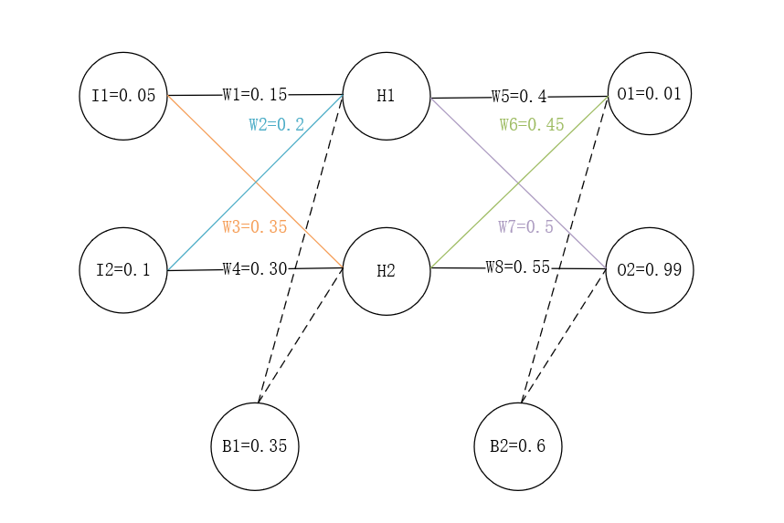
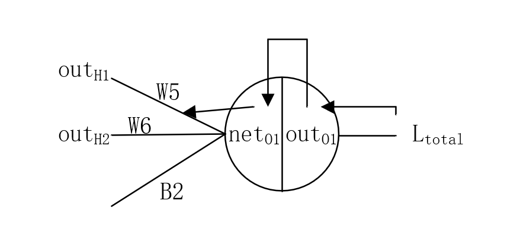
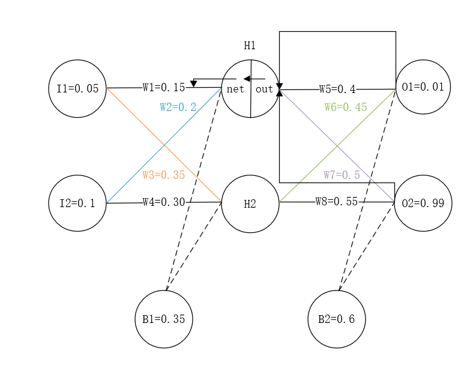

# POP-CNN

## 1. 首先调包

有pandas、torch、numpy

```ptyhon
import pandas as pd
import torch
import numpy as np
import torch.nn as nn
import torch.nn.functional as F
import torch.optim as optim
import torch.nn.init as init
from torch.autograd import Variable
```

## 2. 归一化处理

在这段程序中，先找出每一行（在这个数据集中，每一行为一个传感器采集的样本）的最大值$Zmax$、最小值$Zmin$和均值$Zmean$，然后将数据映射到$[-1,1]$->$Z = (Z - Zmean) / (Zmax - Zmin)$。

```python
def Normlize(Z):
  Zmax, Zmin = Z.max(axis=1), Z.min(axis=1)
  Zmean = Z.mean(axis=1)
  #按列排序
  Zmax, Zmin = Zmax.reshape(-1, 1), Zmin.reshape(-1, 1)
  Zmean = Zmean.reshape(-1, 1)
  Z = (Z - Zmean) / (Zmax - Zmin)
  return Z
```

## 3. 读取数据

原始的excel是这样的：


数据记过处理保存（这个操作我认为是调不同的包数据保存类型不一样才要做的），读取出来之后是一个二维数组：

```python
array([[-1.2000e+00, -1.2000e+00, -1.2000e+00, ...,  6.8000e+00,
         6.8000e+00,  6.8000e+00],
       [-2.3333e+00, -1.3333e+00, -2.3333e+00, ...,  3.6667e+01,
         3.6667e+01,  3.6667e+01],
       [-3.6250e+00, -3.6250e+00, -3.6250e+00, ...,  4.6375e+01,
         4.7375e+01,  4.6375e+01],
       ...,
       [-1.4000e+00, -4.0000e-01, -4.0000e-01, ...,  3.0060e+02,
         2.9860e+02,  2.9660e+02],
       [ 0.0000e+00,  0.0000e+00,  0.0000e+00, ...,  1.6100e+02,
         1.6000e+02,   1.5900e+02],
       [ 0.0000e+00,  0.0000e+00,  0.0000e+00, ...,  9.6200e+02,
         9.5600e+02,  9.4900e+02]])
```

然后把数据进行归一化，这里有六个数据集，一个是训练集，两个测试集，还有两个分别是各自的标签。

这里由于标签是别人给的，嗅感值，也要进行归一化，但是如果是自己的数据，打标签的时候可以有意地把标签放在某一段，如：$[0,1]$之间，就可以不用进行归一化。

```python
train_x_Normed = Normlize(train_x)
test_x_Normed = Normlize(test_x)
test_z_Normed = Normlize(test_z)
train_y = train_y / 10000
testy1 = testy1 / 10000
testy2 = testy2 / 10000
```

最后把每一个数据放进一个东西里面，这里我把这个输出出来，是个tensor。


## 4. 网络设计以及计算过程

在这里是一个3层网络：

```python
self.conv1 = nn.Conv2d(1,6,(16,4),stride=(1,3))
self.conv2 = nn.Conv2d(6,10,(1,3),stride=(1,2))
self.fc = nn.Linear(10*1*41,1)
```

1. 第一层一个卷积神经网络`self.conv1 = nn.Conv2d(1,6,(16,4),stride=(1,3))`，输入为1层，输出6层，卷积核大小为$16*4$，步长为$(1,3)$;

2. 第二层也是一个卷积神经网络`self.conv2 = nn.Conv2d(6,10,(1,3),stride=(1,2))`，输入为6层，输出10层，卷积核大小为$1*3$，步长为$(1,2)$;

3. 第三层是一个全连接层`self.fc = nn.Linear(10*1*41,1)`，这里的意思是把数据乘加起来；

训练代码如下：

```python
batch_size = 14
def train(train_x,train_y,step=20):
  for epoch in range(160):
    for i in range(0,(int)(len(train_x)/batch_size)):
      t_x = Variable(train_x[i*batch_size:i*batch_size+batch_size])
      t_y = Variable(train_y[i*batch_size:i*batch_size+batch_size])
      t_x = t_x.to(device)
      t_y = t_y.to(device)
      out = cnn(t_x)
      #forward
      #loss_func = nn.MSELoss() 均方损失函数  loss(x(i),y(i)) = (x(i) - y(i))^2
      loss = loss_func(out, t_y)
      #梯度初始化为零
      optimizer.zero_grad()

      #backward
      loss.backward()
      optimizer.step()
    if (epoch + 1) % step == 0:
      print('Epoch[{}/{}], loss: {:.12f},'.format(epoch + 1,160, loss.item()))
```

这段代码中，这个网络一共训练了160次，每20次打印一次loss，每次训练又分为$238/14=17$次，每次训练14个样本（我觉得应该是这样），这里每一个样本经过前向传播之后，计算一个loss，然后每一个batch训练完之后，计算一次loss的均值，之后再进行反向传播（计算梯度），最后根据学习率，更新权重；

### 前向传播

那么，前向传播的时候，结构为：

```python
def forward(self, x):
  x = F.relu(self.conv1(x))
  x = F.relu(self.conv2(x))
  x = x.view(x.size(0), -1)
  x = self.fc(x)
  return x
```

卷积出来之后，进入relu激活函数，然后拉成一行，最后和进入全连接层。

那么这个$relu()$呢，是$f(x) = max(0,x)$，输入是个非正数的时候为0，正数为本身的函数。

在此，我把每层的size打印出来：

```python
def forward(self, x):
  x = F.relu(self.conv1(x))
  print(0)
  print(x.size(0))
  print(x.size(1))
  print(x.size(2))
  print(x.size(3))
  x = F.relu(self.conv2(x))
  print(1)
  print(x.size(0))
  print(x.size(1))
  print(x.size(2))
  print(x.size(3))
  x = x.view(x.size(0), -1)
  print(2)
  print(x.size(0))
  print(x.size(1))
  x = self.fc(x)
  print(3)
  print(x.size(0))
  print(x.size(1))
  return x
```

结果为

```python
0
14
6
1
83

1
14
10
1
41

2
14
410

3
14
1
```

1. 这里的`x.size(0) = 14`，是在训练的时候，这个代码设置的，每次训练14个样本；

2. 两个卷积层的`x.size(1)`代表输出的channel；

3. 两个卷积层的`x.size(2)`和`x.size(3)`代表卷积后的大小，第一层为（1,83），第二层为（1,41）；

4. 然后排成一行，最后全连接；

以下为第一层卷积网络计算图示：


$$
x_{ij}^{l} = f(u_{ij}^{l}) = f(\sum_{p = 1}^{n}\sum_{q = 1}^{m}x_{i+p-1,j+q-1}^{l-1}*k_{pq}^{l} + b^{l})  (i = 1,2,...,n)(j=1,2,...m)
$$

在这里，$n=16,m=4$，$l$为当前层数，$(i,j)$表示卷积完之后的位置，$k$为卷积核。

也就是说，这个输入的二维矩阵，和卷积核进行卷积，实际是就是对应位置进行相乘，然后再相加，在加上$bias$之后，经过激活函数$f(·)$输出，如下图例：


那么，对于这个第一层卷积网络，和卷积的基本运算就是这样。

但是，这里有六个卷积核，

在第二层网络中，卷积的个数又变多了，输入为6，输出为10，由于在第一层中，输出是6个$1\*83$ 的二维数组，那么其实第二层的输出就是 $6\*1\*83$ 的三维数组，那么每个第二层的卷积核进行卷积后输出。根据程老师的描述，我觉得公式应该是这样的：

$$
x_{ij}^{l} = f(u_{ij}^{l}) = f(\sum_{a=1}^{6}\sum_{p = 1}^{n}\sum_{q = 1}^{m}x_{i+p-1,j+q-1}^{l-1} * k_{pq}^{l} + b^{l})
$$

这里的$a$是上一层的输出，一共六个输出，然后每个输出和这一层的卷积核进行卷积之后相加之后输出。

那么整个网络就有$6\*16\*4 + 6 + 10\*1\*3 + 10 + 410 + 1 = 841$个参数，也可以说是权值，神经网络就是训练这些东西。

### 反向传播

首先，在所有应用问题中（不管是网络结构，训练手段如何变化）我们的目标是不会变的，那就是网络的权值和偏置最终都变成一个最好的值，这个值可以让我们由输入可以得到理想的输出，于是问题就变成了$y=f(x，w，b)$(x是输入，w是权值，b为偏置)，所有这些量都可以有多个，比如多个$x_1，x_2，x_3……$最后$f(·)$就好比我们的网络它一定可以用一个函数来表示，我们不需要知道$f(x)$具体是怎样的函数，从小我们就认为只要是函数就一定要是可表示的，像$f(x)=sin(x)$一样，但是请摈弃这样的错误观念，我们只需要知道一系列的$w$和$b$决定了一个函数$f(x)$，这个函数让我们由输入可以计算出合理的$y$。

在这里让$(y-t)^2$的值尽可能的小。于是原先的问题化为了$C(w，b)=(f(x，w，b)-t)^2$取到一个尽可能小的值。

分3步

#### 1. 计算loss

在`out=cnn(t_x)`之后，`loss = loss_func(out, t_y)`，在这里，`loss_func = nn.MSELoss()`，公式为：

$$
l(x, y) = L = \{l_1, \ldots ,l_n\},l_{n} = (x_n - y_n)^2
$$

默认下，此函数输出为[`mean`](https://pytorch.org/docs/stable/nn.html?highlight=mseloss#torch.nn.MSELoss)。

由于直接使用`MSELoss()`，那么在`loss = loss_func(out, t_y)`之后，如果`print(loss)`的话，则这个loss是`mean(L)`，也就是：

$$
loss = \frac{ (x_1 - y_1)^2 + (x_2 - y_2)^2 + \ldots + (x_n - y_n)^2 }{ n } ,(n = batchsize = 14)
$$

#### 2. 计算梯度

就是使用loss，计算每一个权值的[梯度](https://baike.baidu.com/item/%E6%A2%AF%E5%BA%A6/13014729?fr=aladdin)。

梯度的本意是一个向量（矢量），表示某一函数在该点处的方向导数沿着该方向取得最大值，即函数在该点处沿着该方向（此梯度的方向）变化最快，变化率最大（为该梯度的模）。

#### 3. 更新权重

$$
weight = weight + v
$$

一般来说：
$$
v = -grad * lr
$$

但是有momentum时:

$$
v = -grad * lr + v_{old} * momentum
$$

#### 4. 例子

假设I1和I2是输入，H1和H2是隐含层，O1和O2是输出，B1和B2是bias。W1~W5是权重。那么我们的目标是，给定I1和I2，使最后的*计算的输出*尽可能与我们*给定的输出*$O1=0.01,O2=0.99$相近。

这里假设我们的激活函数是$relu()$。



a. 输入层->隐含层

$$
net_{H1} = I1 * W1 + I2 * W2 + B1 = 0.05 * 0.15 + 0.1 * 0.2 + 0.35  = 0.3775
$$

$$
out_{H1} = relu(net_{H1}) = 0.3775
$$

同理得：

$$
out_{H2} = 0.3975
$$

b. 隐含层->输出层

$$
net_{O1} = out_{H1} * W5 + out_{H2} * W6 + B2 = 0.3775 * 0.4 + 0.3975 * 0.45 + 0.6 = 0.9299
$$

$$
out_{O1} = relu(net_{O1}) = 0.9299
$$

同理得：

$$
out_{O2} = 1.0074
$$

那么以上是一个前向传播的过程，得到的值$out_{O1} = 0.9299, ut_{O2} = 1.0074$和给定的值$O1=0.01,O2=0.99$相差比较大，那么这个时候就要反向传播，更新权值。

c. 计算误差

$$
L_{total} = \frac{(out_{O1} - O1)^2 + (out_{O2} - O2)^2}{2}    = \frac{(0.9299 - 0.01)^2 + (1.0074 - 0.99)^2}{2} = 0.4231 + 0.0002 = 0.4233
$$

d. 求梯度

这个梯度呢，就是每个权值的梯度。

首先，我们以W5为例子。

我们求的是整体Loss对W5的偏导:

$$
\frac{\partial{L_{total}}}{\partial{W5}} = \frac{\partial{L_{total}}}{\partial{out_{O1}}} * \frac{\partial{out_{O1}}}{\partial{net_{O1}}} * \frac{\partial{net_{O1}}}{\partial{W5}}
$$

如图：



那么：

$$
\frac{\partial{L_{total}}}{\partial{out_{O1}}} = 2 * \frac{1}{2} * (out_{O1} - O1)^{(2-1)} * 1 = 0.9199
$$

$$
\frac{\partial{out_{O1}}}{\partial{net_{O1}}} = relu'(net_{O1}) = 1
$$

$relu()$在非负部分导数为1，其他为0。

$$
\frac{\partial{net_{O1}}}{\partial{W5}} = out_{H1} = 0.3775
$$

那么：

$$
\frac{\partial{L_{total}}}{\partial{W5}} = 0.9199 * 1 * 0.3775 = 0.3473
$$

那么，更新W5的时候(在这里，我们取lr = 0.5)：

$$
W5^{+} = W5 + (- gard * lr) = 0.4 - 0.5 * 0.3473 = 0.2264
$$

同理：

$$
W6^{+} = 0.45 - 0.5 * 0.9199 * 0.3975 = 0.2672
$$

$$
W7^{+} = 0.5 - 0.5 * 0.0174 * 0.3775 = 0.4967
$$

$$
W8^{+} = 0.55 - 0.5 * 0.0174 * 0.3975 = 0.5465
$$

那么，如果去到W1呢，公式就是：

$$
\frac{\partial{L_{total}}}{\partial{W1}} = \frac{\partial{L_{total}}}{\partial{out_{H1}}} * \frac{\partial{out_{H1}}}{\partial{net_{H1}}} * \frac{\partial{net_{H1}}}{\partial{W1}}
$$

同时：

$$
\frac{\partial{L_{total}}}{\partial{out_{H1}}} = \frac{\partial{L_{Loss1}}}{\partial{out_{H1}}} + \frac{\partial{L_{Loss2}}}{\partial{out_{H1}}}
$$



那么下面开始计算：

$$
\begin{align}
\frac{\partial{L_{Loss1}}}{\partial{out_{H1}}} = \frac{\partial{L_{Loss1}}}{\partial{net_{O1}}} * \frac{\partial{net_{O1}}}{\partial{out_{H1}}} \\
= 1  
\end{align}
$$

## 5. 参数初始化

### 1. init.xavier_uniform_(m.weight)

根据[pytorch介绍](https://pytorch.org/docs/stable/nn.init.html?highlight=xavier#torch.nn.init.xavier_uniform_)，这个函数使用均匀分布填充权值，来自[这篇论文](http://proceedings.mlr.press/v9/glorot10a/glorot10a.pdf)权值范围是：

$$
W \sim U \left [ -\frac{ \sqrt{6} }{ \sqrt{n_j+n_{j+1}} }, \frac{ \sqrt{6} }{ \sqrt{n_j+n_{j+1}} } \right ]
$$

所以pytorch包中：

$$
U(-a,a),a=gain*\sqrt{\frac{ 6 }{ fan\_in + fan\_out }}
$$

参数gain默认情况下为1，然后根据我的理解和参考[别人的代码](https://github.com/tostq/DeepLearningC)，应该是随机生成一个`[-1,1]`之间的数，并乘上这个a，`fan_in`和`fan_out`分别是输入层数和输出层数。

### 2. init.normal_(m.weight, std=0.01)

和上面的函数来自同一篇论文，[代码介绍](https://pytorch.org/docs/stable/nn.init.html?highlight=torch%20nn%20init%20normal_#torch.nn.init.normal_)。

在论文中，有公式：

$$
Var \left [ W^i \right ] = \frac{2}{n_i + n_{i+1}}
$$

因此，在这里标准差为：

$$
std = gain* \sqrt{ \frac{2}{fan\_in + fan\_out} }
$$

### 3. init.constant_(m.bias, 0)

[代码介绍](https://pytorch.org/docs/stable/nn.init.html?highlight=torch%20nn%20init%20constant#torch.nn.init.constant_)

函数形式：`torch.nn.init.constant_(tensor, val)`

就是用`val`来填充`tensor`。
